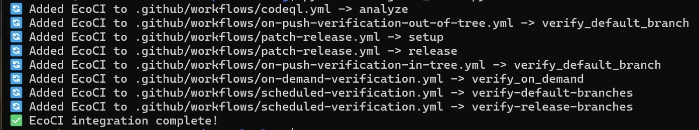

## Context

This project was part of a university capstone with Intel, focused on measuring and analyzing the environmental impact of CI/CD workflows. 

The system uses [Eco-CI](https://github.com/green-coding-solutions/eco-ci-energy-estimation) to collect energy data from GitHub Actions, stores it in a database for analysis and visualization. This implementation used a forked version of Eco-CI from the capstone project.

## My Contribution

My main contribution was `integrate_ecoci.py`, an automation script for instrumenting GitHub Actions workflows with Eco-CI. I also made a smaller improvement to the project's CLI recommendation tool (`ecocli.py`): a local caching layer for carbon-intensity data.

Implementation (team repository): https://github.com/DaxLynch/ecocli-utility

### 1. Workflow instrumentation script (primary contribution)

I implemented `integrate_ecoci.py`, a Python script that automates Eco-CI integration across GitHub Actions workflows.

It scans `.github/workflows/`, checks whether Eco-CI is already present, and inserts the required measurement steps into each job while preserving YAML formatting with `ruamel.yaml`.

#### Script Output

Example output when running the integration script:



The script inserts Eco-CI steps where missing and skips jobs where they are already present.

#### Example Transformation

##### Before:
```
name: CI

on:
  push:
    branches: [main]

jobs:
  test:
    runs-on: ubuntu-latest
    steps:
      - uses: actions/checkout@v4

      - name: Install dependencies
        run: pip install -r requirements.txt

      - name: Run tests
        run: pytest
```

##### After running `integrate_ecoci.py`:
```
name: CI

on:
  push:
    branches: [main]

jobs:
  test:
    runs-on: ubuntu-latest
    steps:
      - name: Start Energy Measurement
        uses: DaxLynch/eco-ci-energy-estimation@main
        with:
          task: start-measurement
          api-endpoint-add: ${{ secrets.ECOCI_API }}

      - uses: actions/checkout@v4

      - name: Install dependencies
        run: pip install -r requirements.txt

      - name: Run tests
        run: pytest

      - name: Test Energy Measurement
        uses: DaxLynch/eco-ci-energy-estimation@main
        with:
          task: get-measurement
          label: 'test'

      - name: Show Energy Results
        uses: DaxLynch/eco-ci-energy-estimation@main
        with:
          task: display-results
```

### 2. Local data caching

`ecocli.py` re-downloaded a full year of hourly carbon-intensity data from Electricity Maps on every run, even for a previously queried location. I changed the lookup to check for a local cache under `data/` first, only hitting the API on a cache miss.

**Before:**
```python
try:
    dl_response = requests.get(csv_url)
    with open(tmp_csv, "wb") as f:
        f.write(dl_response.content)
except Exception as e:
    print("Error downloading CSV:", e)
    return None

try:
    df_zone = load_carbon_data(tmp_csv)
finally:
    os.remove(tmp_csv)  # deleted after every use
```

**After:**
```python
csv_filename = os.path.join(DATA_DIR, f"{zone_key}_2024_hourly.csv")

if os.path.exists(csv_filename):
    print(f"📂 Using cached data from {csv_filename}")
    return load_carbon_data(csv_filename)

# Only reached on a cache miss
dl_response = requests.get(csv_url)
with open(csv_filename, "wb") as f:
    f.write(dl_response.content)
return load_carbon_data(csv_filename)
```
